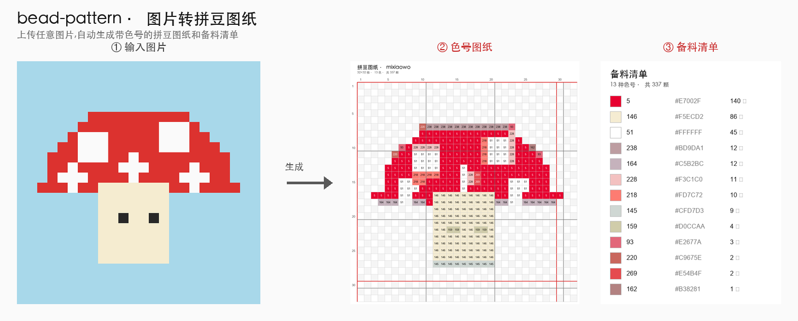
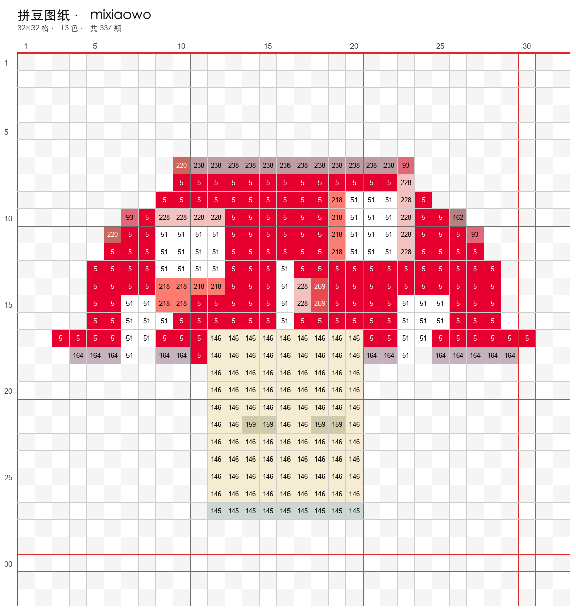
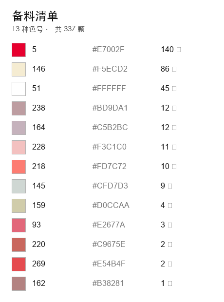
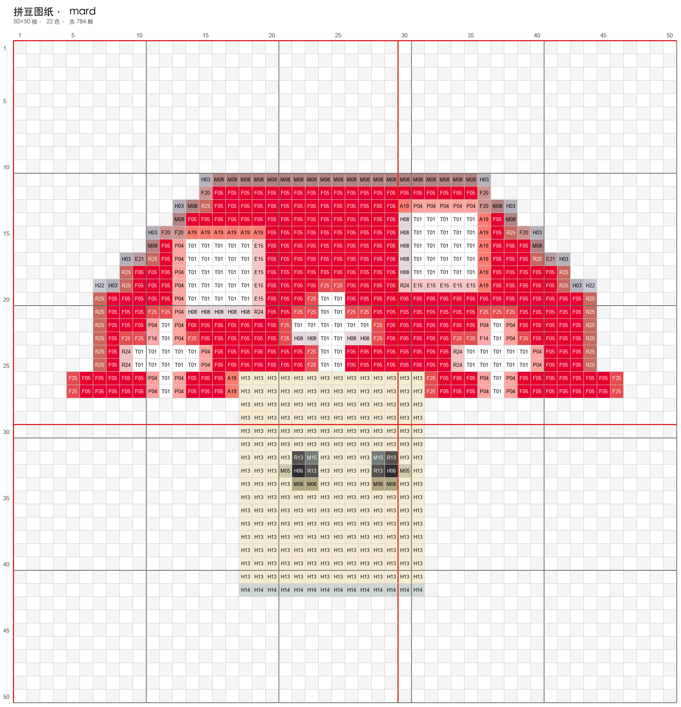
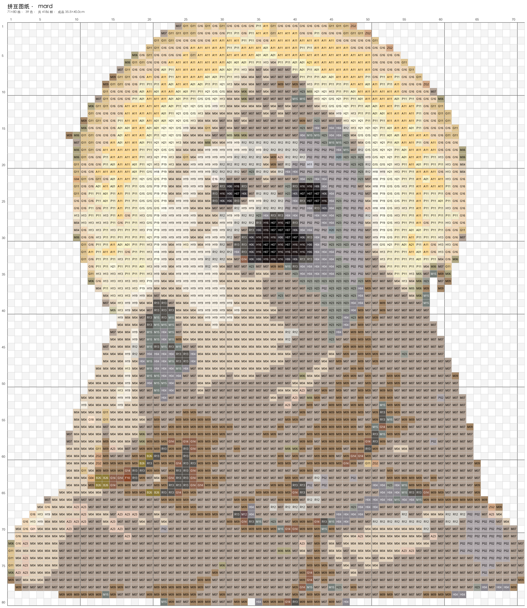
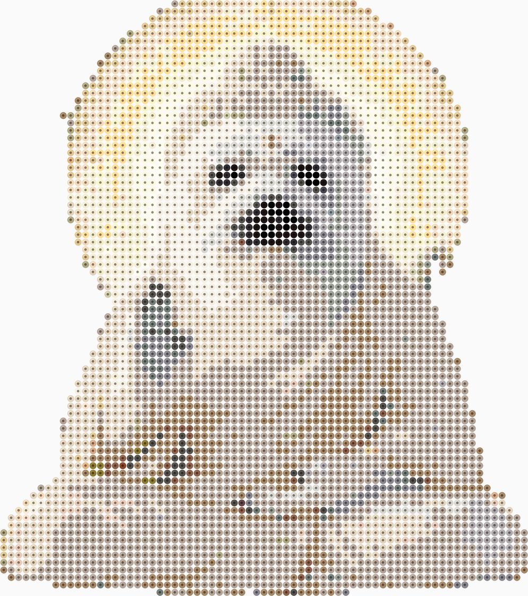
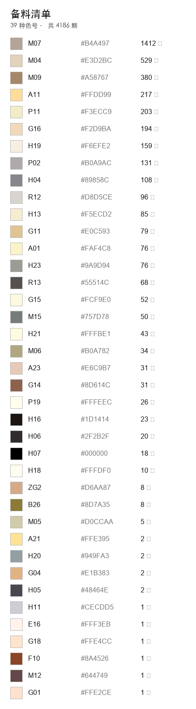
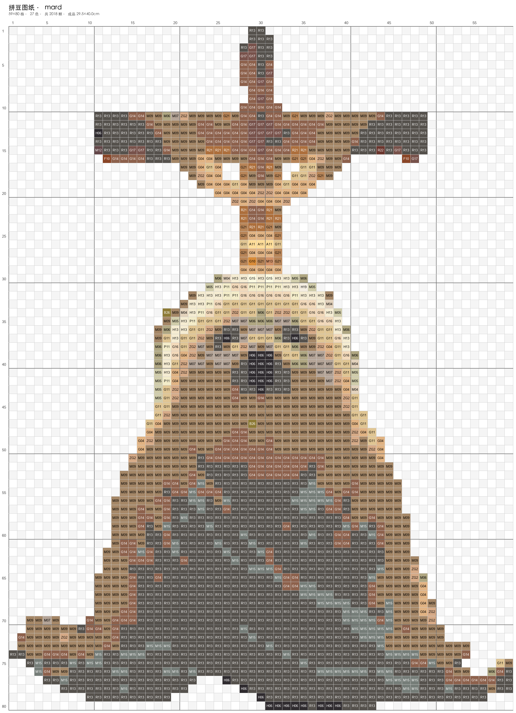
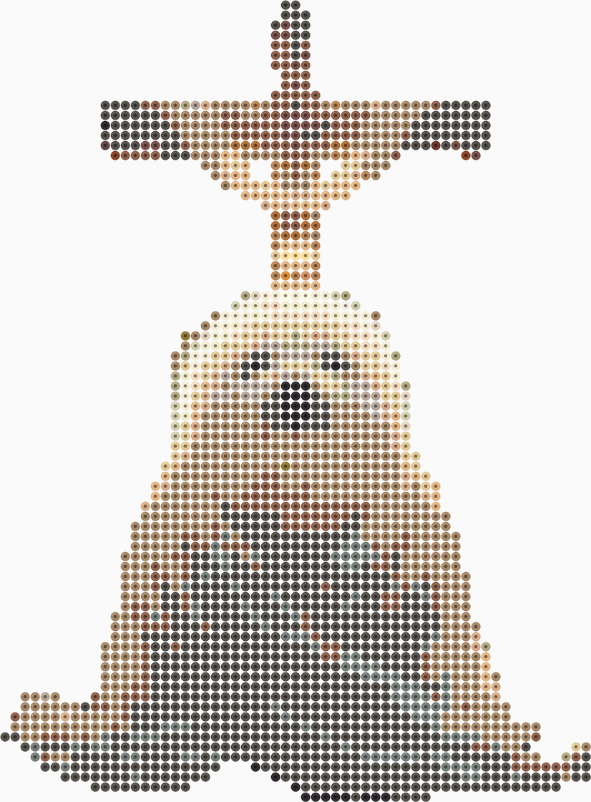

# bead-pattern · 图片转拼豆图纸生成器

把任意图片转成拼豆(perler / hama / fuse beads)图纸:像素化 + 按品牌色卡做
**CIEDE2000 感知色差匹配**,产出带色号的网格图、备料清单、可打印 PDF。

作为 Claude Code Skill 使用(见 `SKILL.md`),也可直接命令行调用。



## 效果示例
同一张图,简易档(限色去杂、好拼)与精细档(高还原):

| 简易档 pattern | 简易档备料清单 | 精细档 pattern |
|---|---|---|
|  |  |  |

> 图纸带色号、行列坐标、每 10 格粗线与单板(29×29)红色板界;背景自动去除显示为空格。

### 实拍照片(MARD 色卡,精细档)
`--palette mard --mode fine --remove-bg ai --crop-subject --max-side 80`:

| 原图 | 图纸(带色号) | 成品预览 | 备料清单 |
|---|---|---|---|
|  |  |  |  |
|  |  |  | |

佛像 71×80 格 · 39 色 · 4186 颗;十字 59×80 格 · 27 色 · 2018 颗。
图纸(`pattern.png`)写色号给人照着拼,成品预览(`preview.py`)不写字只把每格画成
一颗带孔的圆豆,用来在开拼之前判断像不像 —— 两者用的是同一份量化结果。

佛像那版发灰是原图所致,不是流水线问题:该照片最暗的 5% 也只到 135(十字能压到 39),
主体只占明度范围上面三分之一,量化后前两个浅暖灰吃掉将近一半格子。平光照片要拉开层次,
需在配色之前先做对比度/色阶拉伸。

## 快速开始
```bash
cd ~/bead-pattern
# 首次:环境已在 .venv,若需重建:
#   python3 -m venv .venv && ./.venv/bin/pip install Pillow numpy

# 生成示例测试图
./.venv/bin/python scripts/make_sample.py

# 简易档(咪小窝色卡,限色去杂,好拼)
./.venv/bin/python scripts/generate.py assets/samples/mushroom.png --palette mixiaowo --mode simple

# 精细档(MARD 色卡,高还原)
./.venv/bin/python scripts/generate.py assets/samples/mushroom.png --palette mard --mode fine

# 照片最高还原:AI 抠图 + 裁到主体 + 提高格子密度
./.venv/bin/python scripts/generate.py assets/samples/seal-buddha.jpg \
  --mode fine --max-side 80 --remove-bg ai --crop-subject
```

还原度不够时,优先加格子(`--max-side`)、开 `--crop-subject`,而不是加色号:
小面积深色特征(眼睛、鼻头、爪尖)需要占到成片格子才认得出,
格子太少时 `--despeckle` 会把它们当噪点清掉,脸就被抹平。

## 流水线
```
图片 →(去背景)→ 缩放到网格 → 主导色像素化 → CIEDE2000 匹配到色卡
     →(可选:抖动 / 限色 / 去杂)→ 图纸 PNG + 备料 CSV/PNG + 打印 PDF
```

## 技术选型
- **色差算法**:CIEDE2000(CIE-Lab 感知色差,numpy 向量化手写,零重依赖),比 RGB 欧氏更准。
- **去背景**:默认轻量洪水填充(纯色底);照片可选 `rembg` AI 抠图(按需装)。
- **精细/简易两档**:分辨率 + 限色 + 去杂的预设组合,`--dither` 单独控制照片抖动。
- **色卡**:咪小窝 / MARD / COCO / 漫漫 / 盼盼,各 ~291 色(色号↔RGB)。

## 目录
```
bead-pattern/
├─ SKILL.md                 # Claude Code 技能入口
├─ CHANGELOG.md             # 更新日志
├─ scripts/
│  ├─ generate.py           # 主流水线 CLI
│  ├─ preview.py            # 成品预览图(带孔圆豆,开拼前看效果)
│  ├─ build_palettes.py     # 从来源数据构建各品牌调色板
│  ├─ make_sample.py        # 生成零版权测试图
│  ├─ make_showcase.py      # 拼 README 的对比展示图
│  ├─ wb.py                 # 白点校正(暖调逆光照片拉回中性白)
│  ├─ silhouette.py         # 从 pattern.png 反推主体轮廓(ASCII,校验形状)
│  └─ keep_main.py          # 只保留 alpha 最大连通域(剔除主体旁零碎)
├─ palettes/                # mixiaowo/mard/coco/manman/panpan .json
├─ references/source.md     # 色卡数据来源与许可(clean-room 说明)
├─ assets/samples/          # 测试图
└─ output/                  # 生成结果
   └─ <名>-<档>/            # pattern.png/pdf + shopping-list.csv/png
                            # + source.<ext>(原图归档)+ recipe.json(参数)
```

## 许可
算法代码原创;色卡为事实型数据,来源与许可见 `references/source.md`。
